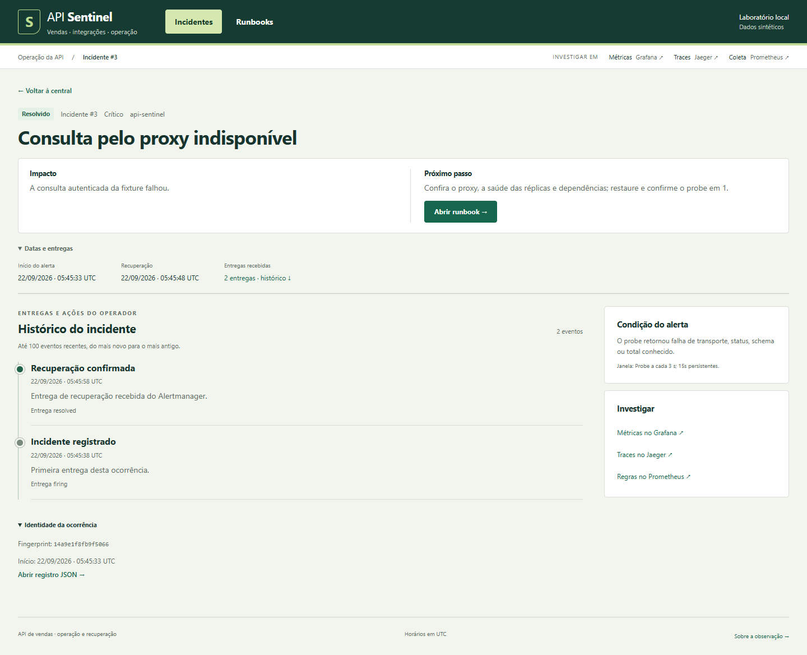

# API Sentinel

API de vendas para integrações de lojas, com acesso por organização, quota compartilhada e isolamento das consultas ao ERP.

Uma consulta ao ERP pode ficar lenta sem bloquear o resumo de vendas. O API Sentinel separa esses caminhos, limita o trabalho em andamento e mantém a quota de cada cliente entre duas réplicas. PostgreSQL calcula os indicadores; Redis coordena quota e cache. As organizações, vendas e o ERP da demonstração são sintéticos.



Captura de 22/09/2026: a mesma ocorrência recebeu abertura e recuperação pelo monitoramento local. Vendas e ERP são sintéticos. Veja a [sequência completa: consulta de R$ 125,00, falha e recuperação](docs/operational-story.md), com versão, observações e limites. As [prévias sintéticas de navegação](docs/interface-validation.md) permanecem identificadas separadamente.

## O que a demonstração permite verificar

| Problema | Entrada → resultado esperado | Como o código resolve e onde conferir |
| --- | --- | --- |
| Consultar outra organização | Token A consultando loja 4 → HTTP 403 | [Autorização](src/api_sentinel/auth.py) antes de cache/SQL; [integração de dados](tests/integration/test_data_postgres.py) |
| Confundir itens com pedidos | 3 itens da fixture, em 2 pedidos → 12500 centavos de receita e 6250 de ticket | [Agregado e período comercial](src/api_sentinel/queries.py); [conta independente](tests/unit/test_data_contract.py) |
| Duplicar quota ao subir uma réplica | 30 tentativas para limite 10, em dois clientes Redis → 10 admissões e 20 recusas 429 | [Operação atômica](src/api_sentinel/admission.py); [teste Redis](tests/integration/test_runtime.py) |
| ERP lento ocupar recursos sem prazo | Corpo recebido aos poucos → deadline total; vendas seguem caminho PostgreSQL | [Cliente ERP limitado](src/api_sentinel/erp.py); [testes de prazo](tests/unit/test_runtime.py) e [medição de coexistência](docs/performance.md) |
| Reabrir um alerta por entrega atrasada | firing → resolved → firing antigo → mesma ocorrência finalizada | [Transação e identidade do alerta](alert_receiver/storage.py); [regressões do receiver](tests/unit/test_receiver.py) |

O limite 10 da tabela é o parâmetro do teste de quota; clientes comerciais da demo têm 30/s por tenant. [Problema e solução](docs/problem-solution.md) detalha os casos e suas provas. [Decisões técnicas](docs/decisoes-tecnicas.md) explica motivo, custo e limite de cada proteção.

A central reúne estado, impacto, momento relevante e investigação em uma lista. Identificação e entregas ficam disponíveis por expansão; o detalhe mostra o procedimento e a cronologia. O filtro Finalizados reúne recuperações recebidas e encerramentos pelo operador, com indicações distintas. O retorno do detalhe e do runbook preserva filtro e ocorrência. A observação do probe tem validade própria; a leitura da página é manual. [Capturas e escopo da validação](docs/interface-validation.md) separam essa revisão da prova operacional.

Para investigar, abra o runbook do incidente, confira tráfego e saturação no Grafana e siga uma requisição no Jaeger. O [roteiro de demonstração](docs/demo.md) apresenta os cenários de consulta, isolamento e recuperação.

| Quero conferir | Onde observar |
| --- | --- |
| Impacto, entrega repetida e recuperação de um alerta | Central → ocorrência → histórico |
| Causa provável e procedimento de recuperação | Runbook da ocorrência ou catálogo de runbooks |
| Quota, latência de respostas corretas, cache e ERP | Métricas · Grafana |
| Caminho e duração de uma requisição amostrada | Traces · Jaeger |
| Réplicas descobertas e atualização da coleta | Coleta · Prometheus |

A ausência de incidentes não comprova disponibilidade global. A central não calcula métricas por cliente nem consulta os targets; as observações de coleta permanecem no Prometheus.

## Rodar no Windows

Requisitos: Docker Desktop com containers Linux, Compose 2.24.4+, PowerShell 7 e Python 3.11+ no host. Reserve pelo menos 2 GiB para a stack; builds e testes exigem recursos adicionais. As dependências Python da aplicação são instaladas no container.

```powershell
./scripts/sentinel.ps1 setup -Replicas 2
./scripts/sentinel.ps1 check
./scripts/sentinel.ps1 test
./scripts/sentinel.ps1 demo
```

O primeiro setup baixa as imagens, prepara a massa e gera tokens locais. Os testes usam bancos e projetos Docker próprios. `./scripts/sentinel.ps1 stop` encerra os containers preservando os volumes.

## Rodar no Linux

```sh
docker compose -f compose.yml build api
docker compose -f compose.yml up -d --wait postgres redis
docker compose -f compose.yml run --rm -e REPLICAS=2 tools python scripts/bootstrap.py
docker compose -f compose.yml run --rm tools python -c 'import json; from pathlib import Path; p=Path("/secrets/public-urls.json"); p.write_text(json.dumps({"grafana":"http://127.0.0.1:3104","jaeger":"http://127.0.0.1:16684","prometheus":"http://127.0.0.1:9104","alertmanager":"http://127.0.0.1:9194"})); p.chmod(0o644)'
docker compose -f compose.yml --profile observability up -d --scale api=2
umask 077
mkdir -p .runtime
docker compose -f compose.yml cp --index 1 api:/secrets/demo.json .runtime/demo.json
```

Todos os serviços publicados ficam em loopback:

| Serviço | Endereço |
| --- | --- |
| Central de incidentes e runbooks | [localhost:9184](http://127.0.0.1:9184/) |
| API e Swagger | [localhost:8104/docs](http://127.0.0.1:8104/docs) |
| Grafana | [localhost:3104](http://127.0.0.1:3104/d/sentinel/api-sentinel) |
| Jaeger | [localhost:16684](http://127.0.0.1:16684/) |
| Coleta por réplica | [localhost:9104/targets](http://127.0.0.1:9104/targets) |
| Alertmanager | [localhost:9194](http://127.0.0.1:9194/) |

Os tokens ficam em `.runtime/demo.json`, ignorado pelo Git. Exemplo de consulta em PowerShell:

```powershell
$tokens = Get-Content .runtime/demo.json -Raw | ConvertFrom-Json
Invoke-RestMethod 'http://127.0.0.1:8104/v1/stores/1/summary?start=2026-01-01&end=2026-01-31' -Headers @{Authorization="Bearer $($tokens.tenant_a)"}
```

A massa comercial cobre 01/01 a 01/03/2026, inclusive. A loja 7 pertence ao tenant técnico e cobre somente 01/01/2026. Para conferir um resultado conhecido, use seu token próprio:

```powershell
$referencia = Invoke-RestMethod 'http://127.0.0.1:8104/v1/stores/7/summary?start=2026-01-01&end=2026-01-01' -Headers @{Authorization="Bearer $($tokens.probe)"}
$referencia | Select-Object revenue_cents, order_count, average_ticket_cents
# Esperado: 12500, 2, 6250 — R$ 125,00 em dois pedidos, ticket de R$ 62,50.
```

Esses valores vêm de três itens definidos na [fixture](src/api_sentinel/seed.py), conferidos por uma [conta independente](tests/unit/test_data_contract.py). O token A não tem acesso à loja 7. O [contrato de dados](docs/data-contract.md) define escopo, cobertura e paginação.

## Arquitetura e verificação

A quota usa janela fixa no Redis; admissão e circuito pertencem a cada processo. O cache evita cálculos simultâneos da mesma chave sem dispensar a quota. O prazo da requisição inclui espera por conexão e SQL, com cancelamento do trabalho quando o cliente desconecta.

[Arquitetura](docs/architecture.md) · [decisões técnicas](docs/decisoes-tecnicas.md) · [problema e solução](docs/problem-solution.md).

Para entender a escolha da stack, o [mapa de responsabilidades e custos](docs/architecture.md#o-requisito-que-justifica-cada-parte) separa consulta, integração ERP, observação e ferramentas de teste. As [dificuldades registradas](docs/decisoes-tecnicas.md#problema-central-e-dificuldades-registradas) mostram os problemas encontrados e o que se conseguiu concluir de cada tentativa. Esses registros explicam decisões de engenharia do laboratório; não representam uso comercial ou economia observada com clientes.

O [CI](.github/workflows/ci.yml) executa análise estática, testes com PostgreSQL e Redis, validação das regras de monitoramento e jornadas HTTP pelo proxy. Os [resultados de verificação](docs/verification.md) e [ensaios de desempenho](docs/performance.md) distinguem medições reais, testes simulados e versões históricas.

A [prova completa de 22/09/2026 às 02:19 UTC](docs/evidence/publication.json) registra 253 casos isolados incluindo subtests, 73 testes HTTP e os cenários de quota, isolamento, falha e recuperação aprovados. Sua imagem também tem três rodadas adicionais de quota e scan correspondentes. Ela antecede a adaptação visual. A [sequência operacional às 05:42 UTC](docs/operational-story.md) identifica a interface atual, 257 testes isolados e 11 subtests, 73 testes HTTP e capturas reais de incidente e recuperação; não repete o benchmark nem o scan. Cada prova preserva sua versão, tentativas e limites.

Os controles de acesso do Redis e do Grafana e o escopo das varreduras estão em [segurança](docs/security.md).

O [índice de provas](docs/verification.md#qual-prova-responde-a-cada-pergunta) distingue a execução operacional, a interface e o CI. Há também um [exercício preparado para outra pessoa](docs/demo.md#exercício-com-outra-pessoa--preparado-ainda-não-realizado), ainda sem resultado humano: localizar o incidente, usar o procedimento e confirmar a recuperação pelo valor conhecido.

## Limites

A janela fixa permite rajadas em sua fronteira. As duas réplicas compartilham um host, que continua sendo ponto único de falha. A demonstração não mede um SLO de 30 dias nem capacidade de um cluster. O dataset é imutável; o TTL do cache não oferece consistência forte para uma futura operação de escrita. Traces usam amostragem de 25% e armazenamento em memória.

Python · FastAPI · PostgreSQL · Redis · NGINX · Prometheus · Grafana · Jaeger. [Licença MIT](LICENSE).
