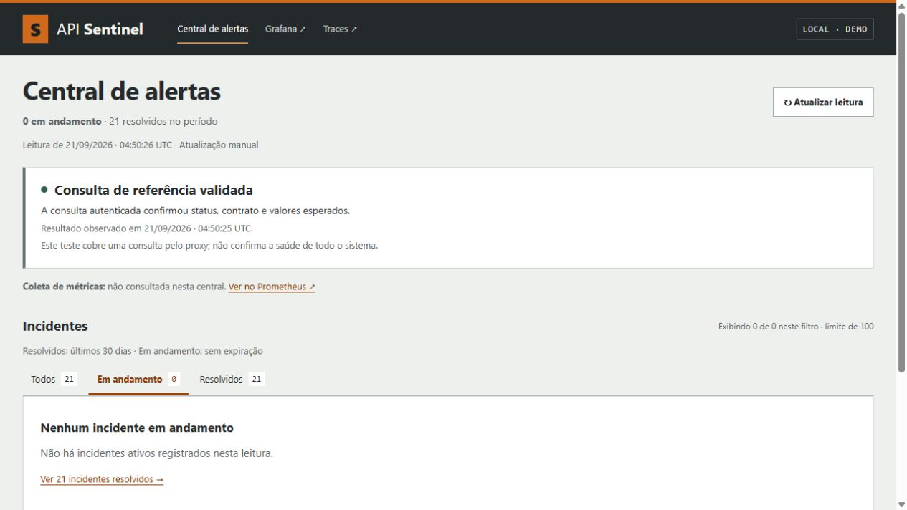

# API Sentinel

API de vendas com limites por organização, cache compartilhado e observabilidade.

Uma consulta ao ERP pode ficar lenta sem bloquear o resumo de vendas. O API Sentinel separa esses caminhos, limita o trabalho em andamento e mantém a quota de cada cliente entre duas réplicas. PostgreSQL calcula os indicadores; Redis coordena quota e cache. As organizações, vendas e o ERP da demonstração são sintéticos.



## O que a demonstração permite verificar

- Consultar lojas autorizadas, resumo por período e vendas com paginação por cursor.
- Consultar disponibilidade no ERP com prazo total, circuito e limite de resposta.
- Saturar um cliente e conferir o atendimento do outro.
- Interromper uma dependência e observar recusa controlada, alerta e recuperação.
- Correlacionar uma requisição com logs, métricas e traces.

A central reúne alertas e runbooks. Prometheus coleta as réplicas; Grafana mostra tráfego e saturação; Jaeger permite inspecionar traces. O [roteiro de demonstração](docs/demo.md) explica os cenários.

## Rodar no Windows

Requisitos: Docker Desktop com containers Linux, Compose 2.24.4+, PowerShell 7 e Python 3.11+ no host. Reserve pelo menos 2 GiB para a stack; builds e testes exigem recursos adicionais. As dependências Python da aplicação são instaladas no container.

```powershell
./scripts/sentinel.ps1 setup -Replicas 2
./scripts/sentinel.ps1 check
./scripts/sentinel.ps1 test
./scripts/sentinel.ps1 demo
```

O primeiro setup baixa as imagens, prepara a massa e gera tokens locais. Os testes usam bancos e projetos Docker próprios. `./scripts/sentinel.ps1 stop` encerra os containers preservando os volumes.

## Rodar no Linux

```sh
docker compose -f compose.yml build api
docker compose -f compose.yml up -d --wait postgres redis
docker compose -f compose.yml run --rm -e REPLICAS=2 tools python scripts/bootstrap.py
docker compose -f compose.yml run --rm tools python -c 'import json; from pathlib import Path; p=Path("/secrets/public-urls.json"); p.write_text(json.dumps({"grafana":"http://127.0.0.1:3104","jaeger":"http://127.0.0.1:16684","prometheus":"http://127.0.0.1:9104","alertmanager":"http://127.0.0.1:9194"})); p.chmod(0o644)'
docker compose -f compose.yml --profile observability up -d --scale api=2
umask 077
mkdir -p .runtime
docker compose -f compose.yml cp --index 1 api:/secrets/demo.json .runtime/demo.json
```

Todos os serviços publicados ficam em loopback:

| Serviço | Endereço |
| --- | --- |
| Central de alertas e runbooks | [localhost:9184](http://127.0.0.1:9184/) |
| API e Swagger | [localhost:8104/docs](http://127.0.0.1:8104/docs) |
| Grafana | [localhost:3104](http://127.0.0.1:3104/d/sentinel/api-sentinel) |
| Jaeger | [localhost:16684](http://127.0.0.1:16684/) |
| Coleta por réplica | [localhost:9104/targets](http://127.0.0.1:9104/targets) |
| Alertmanager | [localhost:9194](http://127.0.0.1:9194/) |

Os tokens ficam em `.runtime/demo.json`, ignorado pelo Git. Exemplo de consulta em PowerShell:

```powershell
$tokens = Get-Content .runtime/demo.json -Raw | ConvertFrom-Json
Invoke-RestMethod 'http://127.0.0.1:8104/v1/stores/1/summary?start=2026-01-01&end=2026-01-31' -Headers @{Authorization="Bearer $($tokens.tenant_a)"}
```

A massa cobre janeiro e fevereiro de 2026. Valores monetários são inteiros em centavos. O [contrato de dados](docs/data-contract.md) define escopo, cobertura e paginação.

## Arquitetura e verificação

A quota usa janela fixa no Redis; admissão e circuito pertencem a cada processo. O cache evita cálculos simultâneos da mesma chave sem dispensar a quota. O prazo da requisição inclui espera por conexão e SQL, com cancelamento do trabalho quando o cliente desconecta.

[Arquitetura](docs/architecture.md) · [decisões técnicas](docs/decisoes-tecnicas.md) · [problema e solução](docs/problem-solution.md).

O [CI](.github/workflows/ci.yml) executa análise estática, testes com PostgreSQL e Redis, validação das regras de monitoramento e jornadas HTTP pelo proxy. Os [resultados de verificação](docs/verification.md) e [ensaios de desempenho](docs/performance.md) distinguem medições reais, testes simulados e versões históricas.

A [prova local de 22/09/2026](docs/evidence/publication.json) registra 253 casos isolados incluindo subtests, 73 testes HTTP e os cenários de quota, isolamento, falha e recuperação aprovados. A imagem executada também tem três rodadas adicionais de quota e scan correspondentes. O histórico de tentativas reprovadas e os limites da medição permanecem na documentação.

Os controles de acesso do Redis e do Grafana e o escopo das varreduras estão em [segurança](docs/security.md).

## Limites

A janela fixa permite rajadas em sua fronteira. As duas réplicas compartilham um host, que continua sendo ponto único de falha. A demonstração não mede um SLO de 30 dias nem capacidade de um cluster. O dataset é imutável; o TTL do cache não oferece consistência forte para uma futura operação de escrita. Traces usam amostragem de 25% e armazenamento em memória.

Python · FastAPI · PostgreSQL · Redis · NGINX · Prometheus · Grafana · Jaeger. [Licença MIT](LICENSE).
