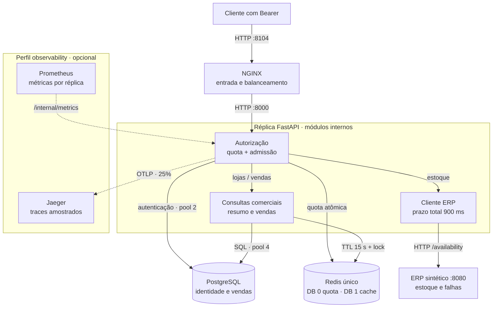

# API Sentinel

API de vendas com acesso por organização, controle de carga e investigação de falhas de um ERP sintético. Desenvolvi o laboratório para conferir a consulta comercial, acompanhar o incidente e verificar sua recuperação no mesmo ambiente local.

<!-- Navegação do README -->
<p>
  <a href="#demonstração"></a>
  <a href="#arquitetura"></a>
  <a href="#executar-localmente"></a>
  <a href="#verificação-e-evidências"></a>
  <a href="https://www.linkedin.com/in/arthur-joanes-6a2967373/"></a>
</p>

## Visão geral

Uma integração consulta faturamento e disponibilidade de produtos. A aplicação separa o caminho comercial do ERP e limita o trabalho em andamento. Os dados e o ERP são **sintéticos**; PostgreSQL, Redis, HTTP e observabilidade executam em containers no mesmo computador.

O que implementei: autorização por loja e organização, cálculos em centavos, quota compartilhada, cache com controle de preenchimento, cliente ERP com prazo total e central com histórico de entregas. [Código e contratos](docs/problem-solution.md).

<a id="na-prática"></a>

## Demonstração


Recorte real de **22/09/2026, 17:37 UTC**, com registros preservados. Mostra a apresentação da fila; fotografar a página não executou falha ou recuperação. [Manifesto da captura](docs/screenshots/focused-20260922/capture.json) · [outros focos](docs/screenshots.md) · [página completa versionada](docs/readme/home.png).

<a id="uma-conta-pequena-antes-de-falar-em-desempenho"></a>

### Uma conta verificável

| Pedido sintético |          Quantidade × preço |         Total |
| ---------------- | --------------------------: | ------------: |
| 101              | 2 × R$ 25,00 + 1 × R$ 35,00 |      R$ 85,00 |
| 102              |                1 × R$ 40,00 |      R$ 40,00 |
| **Resultado**    |  **4 unidades / 2 pedidos** | **R$ 125,00** |

O ticket médio é `125 ÷ 2 = R$ 62,50`. A [fixture independente](data/fixtures/manual-sales.json) define esses valores sintéticos para o período comercial de **01/01/2026**; eles não representam preços de mercado.

Com a credencial da organização técnica, consulte:

```http
GET /v1/stores/7/summary?start=2026-01-01&end=2026-01-01
```

Esperado: `revenue_cents: 12500`, `order_count: 2` e `average_ticket_cents: 6250`. O [roteiro](docs/demo.md) explica a credencial e a execução; a [sequência histórica de 22/09/2026, 12:49 UTC](docs/operational-story.md) liga consulta, falha controlada e recuperação recebida à mesma ocorrência.

<a id="implementação"></a>

## Arquitetura



As setas contínuas representam chamadas e acesso a dados; as pontilhadas, coleta e exportação de telemetria. Os blocos dentro de `api` são módulos do mesmo processo. A [implantação Compose](compose.yml) usa uma rede Docker comum e publica entradas em loopback; as réplicas continuam no mesmo host.

| Responsabilidade | Implementação e contrato |
| --- | --- |
| Identidade e carga | [Rotas](src/api_sentinel/app.py), [autorização](src/api_sentinel/auth.py) e [admissão](src/api_sentinel/admission.py): loja/escopo são conferidos antes da quota Redis e de qualquer acesso ao cache. Limites de concorrência pertencem a cada réplica. |
| Leitura comercial | [Queries](src/api_sentinel/queries.py) e [cache](src/api_sentinel/cache.py): chave inclui versão, tenant, loja e período; um miss coordena o cálculo entre réplicas. O cursor de vendas preserva esses filtros. |
| Dependência ERP | [Cliente HTTP](src/api_sentinel/erp.py): até 4 chamadas por processo, circuito próprio, validação do corpo e até um retry dentro do prazo total de 900 ms. Uma falha no estoque não obriga o resumo de vendas a consultar o ERP. |
| Incidente e investigação | [Receiver](alert_receiver/app.py): consulta a fixture pelo proxy e recebe webhooks do Alertmanager; [SQLite](alert_receiver/storage.py) guarda ocorrência e entregas. Grafana consulta Prometheus e Jaeger recebe os traces. |

**Uma consulta de resumo:** Bearer → autorização → quota → admissão → versão do dataset no PostgreSQL → cache; em miss, SQL e preenchimento protegido por token. **Um alerta:** probe/métricas → Prometheus → Alertmanager → webhook autenticado → SQLite → central HTML. [Sequências, persistência e falhas](docs/architecture.md) detalham esses dois caminhos e suas fronteiras.

## Stack e decisões

<a id="stack"></a>

<p>
  
  
  
  
  
  
  
  
</p>

| Escolha                      | Motivo e compromisso                                                                            |
| ---------------------------- | ----------------------------------------------------------------------------------------------- |
| FastAPI + PostgreSQL         | Consultas autorizadas com SQL explícito; autenticação consulta o banco a cada chamada.          |
| Redis                        | Coordena quota e preenchimento do cache entre réplicas; a quota depende de sua disponibilidade. |
| NGINX + Compose              | Entrada comum e ambiente reproduzível; todos os processos continuam no mesmo host.              |
| Prometheus, Grafana e Jaeger | Métricas, alertas e traces amostrados; uma consulta sem trace ainda exige logs e outros sinais. |

<a id="o-que-eu-implementei"></a>
<a id="escolhas-de-engenharia-e-seus-custos"></a>

[Decisões, alternativas e implementação](docs/decisoes-tecnicas.md) · [versões Python fixadas](uv.lock) · [imagens configuradas](compose.yml). Versões fixadas não são uma declaração de versão mais recente.

<a id="executar-e-verificar"></a>
<a id="executar-e-conferir"></a>

## Executar localmente

Use Docker com containers Linux, Compose **2.24.4+** e Python **3.11+** no host. O Compose mínimo atende ao uso de `!override` no [perfil de revisão](compose.review.yml), conforme a [documentação Docker](https://docs.docker.com/reference/compose-file/merge/#replace-value). Python no host executa o [runner](scripts/review.py); não há medição de memória mínima garantida.

Para uma instalação nova e descartável, com checks, testes e falhas controladas:

```sh
python scripts/review.py
```

O comando informa portas temporárias em `127.0.0.1`, grava resultados em `artifacts/problem-review/<UTC>/` e remove os recursos exclusivos da tentativa. Para explorar a demonstração persistente no Windows, com PowerShell 7:

```powershell
./scripts/sentinel.ps1 setup -Replicas 2
./scripts/sentinel.ps1 check
./scripts/sentinel.ps1 test
./scripts/sentinel.ps1 demo
```

O setup gera credenciais locais; `stop` preserva volumes. [Instalação Linux, credenciais e limpeza](docs/demo.md) · [implementação dos comandos](scripts/sentinel.ps1).

## Verificação e evidências

| Pergunta                              | Fonte e data da execução                                                                                                                                  | Limite                                                                                                                                                |
| ------------------------------------- | --------------------------------------------------------------------------------------------------------------------------------------------------------- | ----------------------------------------------------------------------------------------------------------------------------------------------------- |
| Os contratos passaram nos testes?     | [XML isolado](docs/evidence/editorial-20260922/full-tests.xml) e [HTTP](docs/evidence/editorial-20260922/full-http-tests.xml), **22/09/2026**             | Suítes distintas da imagem identificada no [recibo](docs/evidence/editorial-20260922/full-run.json); não aprovam automaticamente edições posteriores. |
| O ERP degradado coexistiu com vendas? | [Recibo da carga das 12:12 UTC](docs/evidence/editorial-20260922/full-run.json), **22/09/2026**: 151 conclusões, 114 válidas e 37 falhas previstas do ERP | Ensaio curto e local; as falhas do ERP não são contadas como sucesso comercial.                                                                       |
| A mesma ocorrência recuperou?         | [Entregas reais](docs/evidence/editorial-20260922/capture-alerts.json), **22/09/2026**                                                                    | Recuperação recebida é diferente de encerramento manual.                                                                                              |

[Índice de verificações](docs/verification.md) · [fontes e afirmações](docs/fontes-e-afirmacoes.md). Capturas, testes, benchmark e scanner têm escopos próprios; suas contagens não são somadas.

<a id="limites-e-manutenção"></a>
<a id="limites-do-laboratório"></a>
<a id="quando-acesso-capacidade-ou-dependências-falham"></a>

## Limites e segurança

- Quota comercial padrão: **30 requisições/s por organização**; prazo total ERP: **900 ms**. São regras do [seed](src/api_sentinel/seed.py) e do [cliente ERP](src/api_sentinel/erp.py), detalhadas na [matriz de limites](docs/architecture.md#matriz-de-limites); não medem capacidade.
- Dados comerciais imutáveis e duas réplicas no mesmo host. O laboratório não demonstra SLO mensal, capacidade máxima ou disponibilidade entre máquinas. [Escopo das provas](docs/verification.md#escopo).
- Serviços publicados em loopback; tokens e runtime ficam fora do Git. Scans dizem respeito às imagens e bases identificadas em cada execução. [Controles e limites](docs/security.md).
- A central exige atualização manual. “Sem incidentes” não prova saúde; não há sessão com participantes registrada. [Contrato da interface](docs/decisoes-tecnicas.md#histórico-durável-e-uma-interface-que-não-inventa-recuperação) e [exercício ainda não realizado](docs/demo.md#exercício-com-outra-pessoa--preparado-ainda-não-realizado).

## Documentação

| Para entender                    | Guia                                                                                                                            |
| -------------------------------- | ------------------------------------------------------------------------------------------------------------------------------- |
| Problema, componentes e escolhas | [Casos](docs/problem-solution.md) · [arquitetura](docs/architecture.md) · [decisões](docs/decisoes-tecnicas.md)                 |
| Consultas, dinheiro e isolamento | [Contrato de dados](docs/data-contract.md)                                                                                      |
| Executar e investigar            | [Demonstração](docs/demo.md) · [indicadores e procedimentos](docs/slo.md)                                                       |
| Conferir resultados e fontes     | [Verificação](docs/verification.md) · [desempenho](docs/performance.md) · [fontes e datas](docs/fontes-e-afirmacoes.md)         |
| Interface e manutenção           | [Capturas](docs/screenshots.md) · [acessibilidade](docs/frontend-quality.md) · [padrão documental](docs/padrao-documentacao.md) |

## Autor e licença

Para conversar sobre APIs, isolamento e observabilidade neste laboratório:

<p><a href="https://www.linkedin.com/in/arthur-joanes-6a2967373/"> <strong>Arthur Joanes no LinkedIn</strong></a></p>

[Licença MIT](LICENSE). Ícones da stack e LinkedIn: [Devicon — licença MIT](docs/stack/LICENSE.devicon).
