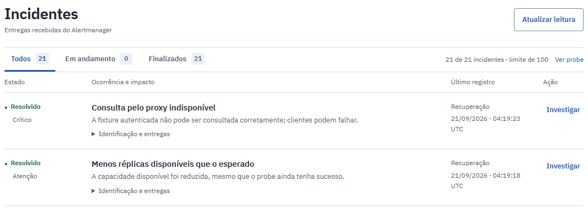
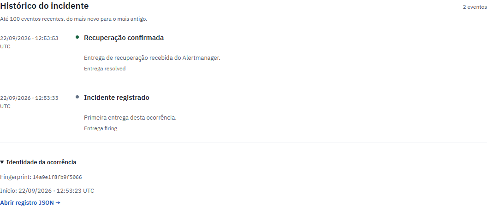
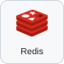

# API Sentinel

API de vendas que separa o acesso de cada organização e limita a interferência de um ERP lento nas consultas comerciais.

Uma integração consulta faturamento e disponibilidade de produtos. Se o ERP começa a responder aos poucos, ele não deve ocupar todas as conexões nem interromper o resumo de vendas. Desenvolvi este laboratório para demonstrar essa separação, conferir os valores retornados e acompanhar a falha até a recuperação.

O projeto é voltado a quem desenvolve ou opera integrações entre lojas. **É um laboratório local com dados e ERP sintéticos**, duas réplicas da API e serviços reais de banco, cache e observabilidade.

[Na prática](#na-prática) · [Implementação](#implementação) · [Executar e verificar](#executar-e-verificar) · [Limites e manutenção](#limites-e-manutenção)

<p></p>

## Na prática



Recorte de apresentação de **22/09/2026, 17:37 UTC**, obtida da interface local atual. Os incidentes exibidos pertencem ao histórico preservado; esta captura não executou falhas nem recuperação. [Recortes de fila e histórico](docs/screenshots.md) · [metadados da captura](docs/screenshots/focused-20260922/capture.json).

**Registro operacional histórico de 22/09/2026, às 12:53 UTC:** o ensaio parou as réplicas da API e a entrega real do monitoramento abriu a ocorrência #2. Confira o impacto e o procedimento indicado. Dados comerciais sintéticos; a falha foi controlada. [Imagem completa](docs/screenshots/editorial-20260922/02-incidente-ativo.png) · [consulta, falha e recuperação da mesma execução](docs/operational-story.md).

### Uma conta pequena antes de falar em desempenho

A [fixture de referência](data/fixtures/manual-sales.json), um conjunto fixo de entradas para conferência, contém três linhas no dia comercial de 01/01/2026:

| Pedido | Quantidade | Preço por unidade | Total da linha |
| ------ | ---------: | ----------------: | -------------: |
| 101    |          2 |          R$ 25,00 |       R$ 50,00 |
| 101    |          1 |          R$ 35,00 |       R$ 35,00 |
| 102    |          1 |          R$ 40,00 |       R$ 40,00 |

São **quatro unidades, dois pedidos e R$ 125,00**. O ticket médio é `125 ÷ 2 = R$ 62,50`. Contar as três linhas como pedidos produziria outro resultado.

Com a credencial da organização técnica, consulte:

```http
GET /v1/stores/7/summary?start=2026-01-01&end=2026-01-01
```

A resposta retorna `revenue_cents: 12500`, `order_count: 2` e `average_ticket_cents: 6250`. O esperado é calculado pelas linhas do banco, sem chamar o agregador da API.

Fora da cobertura conhecida, a consulta é recusada em vez de mostrar um zero aparentemente válido.

[Cálculo e período comercial](src/api_sentinel/queries.py) · [conta independente nos testes](tests/unit/test_data_contract.py) · [verificação com PostgreSQL](tests/integration/test_data_postgres.py).

### Quando acesso, capacidade ou dependências falham

| Situação                                              | Comportamento que precisa ser conferido                                      |
| ----------------------------------------------------- | ---------------------------------------------------------------------------- |
| A organização A consulta a loja 4, pertencente à B    | HTTP 403 antes de cache ou consulta comercial.                               |
| Uma segunda réplica recebe tráfego do mesmo cliente   | A quota comercial continua sendo 30 requisições por segundo por organização. |
| O ERP envia pequenos trechos sem concluir o corpo     | Prazo total de 900 ms; o resumo de vendas usa um caminho independente.       |
| O Redis inteiro fica indisponível                     | HTTP 503; a API não libera SQL sem o controle de quota.                      |
| Uma entrega antiga chega após a recuperação do alerta | O histórico preserva a entrega sem reabrir a mesma ocorrência.               |

O [guia dos casos](docs/problem-solution.md) liga cada entrada ao mecanismo, teste e limite. A [sequência operacional](docs/operational-story.md) mostra a consulta conhecida, a indisponibilidade controlada e a recuperação recebida na mesma ocorrência. Uma indicação visual de sucesso não substitui a consulta, os testes ou os registros de entrega.



Recorte sem alteração de conteúdo: a segunda entrega confirma a recuperação da mesma ocorrência; não houve encerramento manual. O runner voltou a conferir R$ 125,00 e dois pedidos após restaurar as réplicas. [Tela completa](docs/screenshots/editorial-20260922/03-mesma-ocorrencia-recuperada.png) · [eventos e identidade](docs/evidence/editorial-20260922/03-mesma-ocorrencia-recuperada.json).

<p></p>

## Implementação

### O que eu implementei

- **Contrato das consultas:** autorização por organização, loja e permissão; cálculo em centavos; período comercial de São Paulo; cobertura explícita e paginação vinculada ao escopo.
- **Controles de trabalho:** quota atômica compartilhada no Redis, limites de concorrência, conexões separadas para autenticação e negócio, cache com trava de preenchimento e cliente ERP com prazo total.
- **Receiver e central:** persistência de alertas e entregas, tratamento de repetição e ordem invertida, distinção entre recuperação e encerramento administrativo, procedimentos de investigação e consulta de referência com validade explícita.
- **Demonstração reproduzível:** fixture financeira, simulador de ERP, carga com conferência dos resultados, falhas controladas, testes, coleta de evidências e limpeza de projetos descartáveis.
- **Configuração operacional:** regras do Prometheus/Alertmanager, painel do Grafana, instrumentação OpenTelemetry, correlação com Jaeger e integração no CI. Essas ferramentas são de terceiros; implementei sua configuração e integração ao laboratório.

### Stack

<p>
  
  
  
  
  
  
  
  
</p>

Python e FastAPI na API; PostgreSQL nos dados; Redis na quota e no cache; NGINX na entrada. Docker Compose executa os serviços. Prometheus e Grafana acompanham métricas e alertas; Jaeger recebe os traces.

### Escolhas de engenharia e seus custos

Autorizei a loja **antes** de consultar o cache, para que um resultado já calculado não contorne a permissão. A credencial é consultada no banco a cada requisição; isso torna a revogação observável na próxima chamada, mas exige um orçamento próprio de conexões e tempo.

Separei quota de concorrência: Redis limita as chegadas da organização entre réplicas; cada processo limita o trabalho em andamento. A primeira recusa usa HTTP 429; indisponibilidade ou saturação usam 503. A janela fixa é simples de coordenar, mas permite rajadas em sua fronteira.

No ERP, um timeout de leitura isolado não basta para um corpo que chega continuamente. O prazo total abrange corpo e validação; após falhas, um circuito suspende temporariamente novas tentativas. Esse circuito é local a cada réplica e não garante disponibilidade do fornecedor.

[Decisões, alternativas e compromissos](docs/decisoes-tecnicas.md) · [arquitetura e fronteiras dos componentes](docs/architecture.md).

<p></p>

## Executar e verificar

### Executar e conferir

Requisitos: Docker com containers Linux, Compose 2.24.4+ e Python 3.11+ no host. As dependências da aplicação são instaladas na imagem com lock congelado. Reserve pelo menos 2 GiB para a stack e recursos adicionais para build/testes.

Para uma **instalação nova e descartável**, incluindo análise estática, testes, carga e falhas controladas:

```sh
python scripts/review.py
```

O comando cria banco, credenciais, rede e volumes exclusivos. As portas são temporárias em `127.0.0.1`; a saída informa as URLs. Ao terminar, remove somente os recursos que criou e preserva os registros em `artifacts/problem-review/<UTC>/`. Execute sem outra carga pesada no Docker.

Para explorar a demonstração persistente no Windows, com PowerShell 7:

```powershell
./scripts/sentinel.ps1 setup -Replicas 2
./scripts/sentinel.ps1 check
./scripts/sentinel.ps1 test
./scripts/sentinel.ps1 demo
```

O setup gera credenciais locais; `stop` preserva os volumes. O [roteiro de execução](docs/demo.md) contém instalação no Linux, consultas autenticadas, captura pelo navegador e limpeza de uma execução mantida com `--keep`. Tokens e arquivos de sessão ficam fora do Git.

Os [resultados de verificação](docs/verification.md) identificam versão, comandos, imagem e escopo de cada prova. [Desempenho](docs/performance.md) separa respostas corretas, recusas e iterações perdidas; [segurança](docs/security.md) delimita as varreduras. Um workflow existente não aprova automaticamente alterações locais posteriores.

<p></p>

## Limites e manutenção

### Limites do laboratório

As duas réplicas compartilham um host. As execuções curtas não medem capacidade máxima, disponibilidade entre máquinas ou um SLO de 30 dias. O dataset é imutável; o cache com expiração não resolve a consistência de futuras escritas. Redis continua sendo uma dependência compartilhada da quota e do cache. Traces são amostrados em 25% e guardados em memória.

A central mostra uma leitura atualizada manualmente. “Sem incidentes” não significa “saudável”; “Encerrado pelo operador” não significa que chegou uma recuperação. Ainda não houve sessão de uso com participantes; o [exercício preparado](docs/demo.md#exercício-com-outra-pessoa--preparado-ainda-não-realizado) permanece identificado como tal.

[Licença MIT](LICENSE) · [interface e acessibilidade](docs/frontend-quality.md) · [contrato de dados](docs/data-contract.md).

Ícones da stack: [Devicon — licença MIT](docs/stack/LICENSE.devicon).
