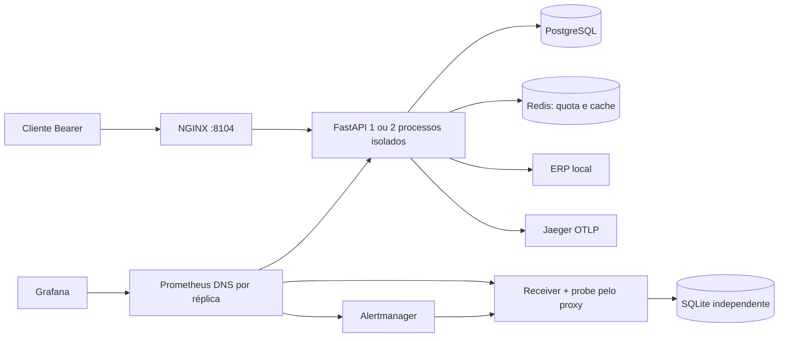

# Arquitetura do API Sentinel

## Fluxo

API local de consultas de duas redes fictícias. Limita concorrência e quota por tenant. A central de alertas, Grafana, logs JSON e Jaeger ajudam a investigar falhas.

Consulta: entrada global imediata → autenticação em pool próprio e prazo curto → autorização de loja/escopo → quota atômica Redis → admissão local por tenant → cache ou SQL limitado → resposta. A integração ERP libera conexão de autenticação antes de HTTP externo. Saúde e métricas têm caminhos separados. A ordem evita esgotar o banco com credenciais inválidas.

Alerta: probe independente consulta fixture pelo proxy → scrape/evaluation Prometheus → persistência `for` → agrupamento Alertmanager → webhook autenticado → transação SQLite → UI. Recuperação utiliza o mesmo fingerprint/início; uma entrega atrasada não reabre incidente resolvido.

## Componentes

Escolha: FastAPI/SQLAlchemy Core assíncrono, Alembic, PostgreSQL, Redis, NGINX e observabilidade opcional. Core explicita SQL sem um repositório genérico; HTML no receiver dispensa frontend separado. Uma aplicação única com SQLite/cache em memória seria mais simples, porém não exercitaria pools PostgreSQL, quota compartilhada e perda de réplica. Kubernetes, collector, Loki e OAuth hospedado aumentariam custo operacional sem serem necessários ao laboratório; ficam fora do escopo.

## Dados e contratos

Duas organizações comerciais, seis lojas e quarenta produtos; um terceiro tenant técnico exclusivo do probe, sem organização comercial, usa uma sétima loja-fixture isolada. Este acréscimo atende ao isolamento exigido para o probe. Itens guardam centavos e quantidade; pedidos são contados por `(store_id, order_id)`. Seed determinística de 60 dias, versão imutável e fixture com receita manual de 12.500 centavos em dois pedidos. Datas comerciais são dias inclusivos de São Paulo convertidos para intervalo UTC semiaberto; intervalo máximo 90 dias. Ausência de cobertura retorna erro explícito. Cursor assinado vincula tenant, loja, período e versão; ordenação por instante/id únicos. A versão avançada invalida cursores e cache.

Credenciais aleatórias são armazenadas apenas como SHA-256 no banco; material local fica em volume de segredos fora do Git. Cada request consulta expiração/revogação, inclusive em duas réplicas. Papel SQL da API é somente leitura e não superusuário; migração/seed têm credencial separada.

## Matriz de limites

| Recurso | Limite atual | Escopo e excesso |
|---|---:|---|
| Entrada API | 48 requests ativos | processo; 503 imediato |
| Autenticação | 8 admitidos, pool 2, deadline 500 ms | processo; 503; até 6 aguardam conexão por no máximo 200 ms |
| Negócio | 16 ativos / 8 por tenant | processo; 503 imediato sem fila |
| Quota | 30/s por tenant comercial; 10/s probe | Redis global; 429 + Retry-After |
| PostgreSQL | pool 4 negócio + 2 auth, overflow 0, aquisição 200 ms | processo |
| SQL | statement_timeout 800 ms; idle transaction 2 s | conexão |
| ERP | 4 ativos; pool 4; prazo total 900 ms; até 1 retry | processo; circuito após 3 falhas |
| Cache | TTL 15 s; lock distribuído 2 s; espera 250 ms | Redis; fallback limitado se só cache falhar |
| Payload | página 100, cursor 2 KiB, headers 8 KiB, corpo 16 KiB | proxy e API |
| Telemetria | amostra 25%, export queue 256; retenção limitada | processo/serviço |

Orçamento com duas réplicas: `2 × 1 × (4 + 2) = 12` conexões. Mais 4 ferramentas/migrações, 4 margem de diagnóstico e 10 de reserva = 30; PostgreSQL max_connections=40. O limite por tenant é justiça local; não é um scheduler global. Mais réplicas exigem refazer esse orçamento.

As configurações de admissão podem reduzir esse orçamento, preservando `tenant <= negócio <= entrada`, e recusam valores acima dos máximos desta matriz. TTL deve ficar entre 1 e 300 segundos; sampling entre 0 e 1. O startup recusa modo diferente de `demo`/`test` e segredo de cursor inválido. Isso evita iniciar com credenciais locais e uma configuração que pareça de produção, ou transformar um erro de configuração em 503 permanentes/erros tardios.

A autenticação inicialmente admitia quatro operações. Duas recusas desse estágio durante uma carga de quota a 60/s, mesmo após aquecimento, motivaram o ajuste para oito. O pool e seus prazos não aumentaram; não há cache de credenciais e a revogação continua consultada em cada chamada. O ajuste e a repetição estão em [problem-solution.md](problem-solution.md) e [verification.md](verification.md).

## Cache e falhas

Chave inclui contrato, versão lida do banco, tenant, loja, datas normalizadas. Autorização sempre precede lookup. `data_updated_at` corresponde à massa, `observed_at` ao cálculo e `cache_age_seconds` cresce no hit. Não há stale nem alegação de consistência forte. Lock Redis usa token e remoção condicional. A indisponibilidade exclusiva do cache permite SQL sob admissão; Redis inteiro indisponível faz a quota falhar fechada com 503. Injeções são comandos locais/arquivos internos, nunca endpoints públicos de falha.

## Ameaças e mitigação

| Ameaça | Controle e teste |
|---|---|
| BOLA / escopo cruzado | credencial determina tenant/lojas; testes com IDs válidos e cursores cruzados |
| Consumo ilimitado / credenciais inválidas | limites antes do auth, pool separado, paginação, deadline, quota atômica |
| SQL injection | SQL parametrizado e ordenação fixa |
| SSRF / resposta maliciosa | destino ERP configurado, SKU validado, sem redirects/proxy ambiente, bytes/schema limitados |
| Vazamento de segredo | logs sem headers/query/payload, hash no banco, volumes de segredo, métricas internas |
| Webhook falso/repetido | Bearer próprio, bytes/schema limitados, chave fingerprint+startsAt, transação antes do 2xx |
| Header forjado | proxy sobrescreve encaminhamento; servidor não confia indiscriminadamente no cliente |

CORS desabilitado; API usa Bearer, sem cookies de negócio. UI operacional somente loopback; Grafana com acesso local de leitura. Não há envio externo.

O OpenAPI declara a autenticação Bearer e os modelos de resposta, incluindo unidades monetárias, cobertura e cursor. A validação do HTTPBearer apenas interpreta o cabeçalho; autenticação, revogação, escopo e quota continuam no fluxo explícito da aplicação. Cabeçalhos Authorization duplicados são recusados para evitar credenciais ambíguas entre proxy e aplicação.

Falhas inesperadas preservam tipo da exceção e os últimos oito locais de código (arquivo, função e linha) no log correlacionado. Mensagem, código-fonte e variáveis locais não são serializados: podem conter SQL, payloads ou segredos. O cliente continua recebendo apenas o problema estável e request_id.

## Indicadores e verificação

Disponibilidade inicial de referência 99,9% e 95% das requisições elegíveis <500 ms em 30 dias são hipóteses, não resultados desta demo. Contador da API cobre apenas requests observados; probe/cliente medem proxy separadamente. 503 conta como falha; 429 de quota contratada é visível e separado. Prometheus descobre IPs de todas as réplicas por DNS Docker; não coleta via balanceador. Demo e referência usam arquivos mutuamente exclusivos.

Testes: fixture independente de dinheiro/pedidos; integração com banco/Redis próprios; segurança, cursor, revogação e cancelamento; promtool saudável/pico/falha/recuperação/ausência/reset; k6 chegada constante; falhas reais de réplica, toda API, Redis, cache, ERP e traces. Os arquivos em artifacts registram resultados observados e limites do gerador. Medições em máquina local com Docker Desktop, com outras stacks ativas.

Fontes oficiais consultadas: [SQLAlchemy pools](https://docs.sqlalchemy.org/en/20/core/pooling.html), [FastAPI lifespan](https://fastapi.tiangolo.com/advanced/events/), [HTTPX timeout](https://www.python-httpx.org/advanced/timeouts/), [OWASP API Security](https://api-security.owasp.org/editions/2023/en/0x11-t10/). Versões efetivas foram fixadas pelo lock e imagens e registradas na verificação.

## Detalhes de implementação

### Testes operacionais isolados

`scripts/review.py` aplica compose.review.yml com projeto novo `pf-api-sentinel-review-<UTC>`, imagem própria, portas loopback efêmeras e volumes exclusivos. A configuração funcional deriva do mesmo Compose, sem compartilhar bancos/cache/segredos/receiver da demonstração. Cargas/falhas dos scripts exigem esse contexto. Resultados ficam em artifacts/problem-review/<execução>, com fingerprint dos fontes sem commit, comandos, versões, limites e falhas preservadas. A remoção automática atinge somente os projetos gerados naquela chamada; `--keep` mantém uma execução aprovada para inspeção e registra seu comando de encerramento.

A central resolve `/tools/{serviço}/...` pelo arquivo PUBLIC_URLS_FILE gerado para a execução. Somente origens loopback explícitas são aceitas; arquivo ausente/inválido retorna 503, sem redirecionar silenciosamente para a demonstração. Isso evita investigar o Grafana de outro ambiente quando as portas mudam. Metadados de alertas são convertidos para navegação local, não escolhem o host de destino.

O verificador da carga (`scripts/review_oracle.py`) lê linhas brutas no PostgreSQL e calcula soma/pedidos/arredondamento com inteiros em script separado; não chama o agregado da aplicação. Cada 200 é confrontado com identidade, filtros, versão e conteúdo esperado. Contadores distinguem válidos, quota, capacidade, ERP, contrato incorreto e outros erros; latências de sucesso e erro ficam separadas. Resultados executados estão em [verification.md](verification.md).

O estado só vira `passed` depois da limpeza. Durante ela, fica `cleanup_pending`; falhas de transporte do Docker, inclusive timeout antes de obter exit code, gravam `failed` e `cleanup_failure` sem apagar a falha de medição anterior. Essa correção do orquestrador foi testada separadamente depois da matriz operacional; os hashes e o escopo estão na verificação.

A quota usa janela fixa de um segundo, operação Lua atômica e TTL. Pode haver burst junto à fronteira; não equivale a uma janela deslizante. Redis usa noeviction: esgotamento de memória pode afetar quota e deve falhar fechado, sem fallback para contadores locais. Cache usa usuário ACL e banco Redis distintos, permitindo testar falha apenas dessa camada. Ambos continuam no mesmo processo Redis e compartilham sua disponibilidade.

O middleware ASGI limita a resposta a 256 KiB antes de enviar headers, além dos limites de entrada. O prazo total é de dois segundos, com limpeza do downstream e do watcher antes de liberar recursos; a tentativa de enviar um erro recebe até 200 ms adicionais. Erros de protocolo anteriores à aplicação são tratados pelo proxy. A API mantém pools separados para autenticação e dados; o gauge lê o estado real após devolver conexões.

ERP e probe recusam respostas comprimidas e validam limite de bytes antes de acrescentar chunks ao buffer. O span manual `erp.availability` cobre corpo e validação; o span HTTPX cobre a chamada até os headers. Essa separação foi acrescentada após investigar o cenário de trickle real.

Segredos locais são montados somente nos containers que precisam deles; o bootstrap aplica leitura compartilhada no volume para UIDs distintos, não uma promessa de isolamento entre processos que já possuem esse volume. UI e ferramentas operacionais são locais. Resultados e desvios encontrados estão em [verification.md](verification.md), com as limitações da medição em [performance.md](performance.md).
