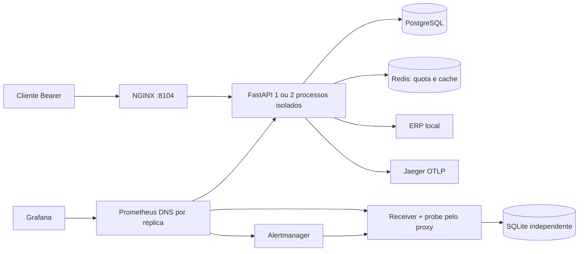

# Arquitetura do API Sentinel

Base técnica conferida em **22/09/2026**: [serviços e imagens](../compose.yml), [admissão](../src/api_sentinel/admission.py), [pools](../src/api_sentinel/db.py), [ERP](../src/api_sentinel/erp.py) e [histórico do receiver](../alert_receiver/storage.py). Limites abaixo são configuração/contrato; medições conservam a data e a imagem dos próprios recibos.

## Fluxo

API local de consultas de duas redes fictícias. Limita chamadas em andamento (concorrência) e chegadas por segundo (quota) por organização (tenant). A central de alertas, Grafana, logs JSON e Jaeger ajudam a investigar falhas. Todos os componentes desta implantação rodam no mesmo computador; duas réplicas são dois processos, não dois hosts independentes.

Consulta: entrada global imediata → autenticação em pool próprio e prazo curto → autorização de loja/escopo → quota atômica Redis → admissão local por tenant → cache ou SQL limitado → resposta. A integração ERP libera conexão de autenticação antes de HTTP externo. Saúde e métricas têm caminhos separados. A ordem evita esgotar o banco com credenciais inválidas.

Alerta: probe independente consulta fixture pelo proxy → scrape/evaluation Prometheus → persistência `for` → agrupamento Alertmanager → webhook autenticado → transação SQLite → UI. Recuperação utiliza o mesmo fingerprint/início; uma entrega atrasada não reabre incidente resolvido.

## Seguir um caso no código

| Caso e resultado verificável                                       | Caminho de implementação                                                                                                                         | Por que esse limite existe                                                                  |
| ------------------------------------------------------------------ | ------------------------------------------------------------------------------------------------------------------------------------------------ | ------------------------------------------------------------------------------------------- |
| A consulta da loja 4 com credencial A termina em 403               | [app](../src/api_sentinel/app.py) → [auth](../src/api_sentinel/auth.py), antes do cache/ERP                                                      | Um resultado em cache não concede acesso; identidade vem da credencial                      |
| Fixture retorna 12500 centavos, 2 pedidos e ticket 6250            | [seed](../src/api_sentinel/seed.py) → [queries](../src/api_sentinel/queries.py) → [teste PostgreSQL](../tests/integration/test_data_postgres.py) | Contar itens como pedidos muda o ticket; período comercial precisa de fronteira UTC correta |
| Redis indisponível termina em 503 antes do resumo SQL              | [enforce_quota](../src/api_sentinel/admission.py) → [app](../src/api_sentinel/app.py)                                                            | Fallback só do cache não pode remover a quota compartilhada                                 |
| ERP envia chunks sem concluir; orçamento encerra a chamada         | [erp](../src/api_sentinel/erp.py) → [teste de deadline](../tests/unit/test_runtime.py)                                                           | Timeout de leitura mede inatividade; prazo total limita a operação inteira                  |
| Repetição e firing atrasado ficam no histórico da mesma ocorrência | [receiver](../alert_receiver/app.py) → [storage](../alert_receiver/storage.py) → [testes](../tests/unit/test_receiver.py)                        | A identidade é fingerprint + início, não cada entrega                                       |

Em [decisões técnicas](decisoes-tecnicas.md), cada escolha explicita motivo, custo e limite. [Problema e solução](problem-solution.md) liga entradas, resultados e provas, sem atribuir medições históricas ao fonte atual.

Na UI, filtro tipado e ID numérico limitado preservam central → detalhe → runbook → retorno. “Finalizados” agrupa recuperações recebidas e encerramentos administrativos, sem mudar os estados persistidos nem o contrato JSON. O [HTML](../alert_receiver/ui.py) distingue os dois casos e não infere saúde a partir da lista vazia. JavaScript não consulta novas métricas nem renova o probe: apenas expira a indicação, abre detalhes e orienta o foco. Navegadores recebem uma página navegável se o destino de investigação não estiver configurado; clientes JSON conservam o problema HTTP 503.

## Componentes

Escolha: FastAPI/SQLAlchemy Core assíncrono, Alembic, PostgreSQL, Redis, NGINX e observabilidade opcional. Core explicita SQL sem um repositório genérico; HTML no receiver dispensa frontend separado. Uma aplicação única com SQLite/cache em memória seria mais simples, porém não exercitaria pools PostgreSQL, quota compartilhada e perda de réplica. Kubernetes, collector, Loki e OAuth hospedado aumentariam custo operacional sem serem necessários ao laboratório; ficam fora do escopo.

### O requisito que justifica cada parte

| Parte                                     | O que resolve aqui                                                                     | Dependência e custo da escolha                                                                                                                  |
| ----------------------------------------- | -------------------------------------------------------------------------------------- | ----------------------------------------------------------------------------------------------------------------------------------------------- |
| API + PostgreSQL                          | Autorizar a organização e calcular vendas/pedidos com um contrato único                | Autenticação e consultas dependem do banco; cada réplica consome conexões, contabilizadas abaixo.                                               |
| Redis                                     | Manter a mesma quota entre réplicas e coordenar preenchimentos do cache                | O mesmo processo guarda quota e cache. Se ele cair, a quota recusa novas consultas; ter dois usuários não cria dois serviços independentes.     |
| NGINX                                     | Dar ao cliente uma entrada comum para as réplicas e limitar a entrada HTTP             | Acrescenta um processo e uma configuração a operar; não remove a falha do host.                                                                 |
| Simulador ERP                             | Reproduzir resposta lenta, indisponível ou inválida sem depender de um fornecedor real | Só o caminho de disponibilidade de produtos depende dessa resposta; o resumo de vendas usa o PostgreSQL.                                        |
| Prometheus + Alertmanager + receiver      | Observar condições, entregar transições e conservar o histórico da ocorrência          | Perfil opcional de observação. Sua falha pode impedir detectar ou entregar alertas, mesmo que a API continue respondendo.                       |
| Grafana + Jaeger                          | Investigar métricas e o caminho de uma requisição amostrada                            | Não são a fonte dos valores de negócio. Exigem memória e retenção próprias; sem trace para uma requisição, a investigação usa os demais sinais. |
| Ferramentas, migrações e gerador de carga | Preparar dados e verificar contratos de forma repetível                                | Executam sob demanda; não são componentes que um cliente precisa chamar para consultar vendas.                                                  |

Os serviços e perfis estão definidos no [Compose](../compose.yml). A separação acima descreve responsabilidades; não transforma esta stack em uma instalação de alta disponibilidade. Para poucas consultas em um único processo, API + PostgreSQL é uma alternativa menor a avaliar. Redis se justifica aqui pelo requisito explícito de quota compartilhada; a observabilidade completa se justifica pelo objetivo de investigar e demonstrar falhas. Não houve comparação de custo total com uma solução comercial.

### Vocabulário usado nas regras

- **Admissão:** aceitar ou recusar trabalho antes de ocupar recursos; não é uma fila persistente.
- **Pool:** conjunto limitado de conexões reutilizadas com o banco. Esperar uma conexão também consome o prazo da requisição.
- **Deadline:** prazo total da operação. Difere de um timeout que só mede silêncio entre dois trechos de resposta.
- **Circuito:** recusa temporariamente chamadas a uma dependência após falhas; uma tentativa posterior verifica se ela voltou.
- **Probe:** consulta automática de um resultado conhecido pelo mesmo proxy usado pelo cliente.
- **Fixture e oráculo:** a fixture é um conjunto pequeno de dados com resultado conhecido; o oráculo calcula a referência de forma independente da consulta que está sendo testada.
- **Firing/resolved:** condição de alerta ativa/recuperada entregue ao receiver. Encerramento manual é um evento administrativo separado.
- **Trace:** registro amostrado das etapas de uma requisição; não é uma gravação de todas as chamadas.
- **SLI e SLO:** o SLI é um indicador com população e cálculo definidos; o SLO é o objetivo para esse indicador em uma janela. Uma meta de 30 dias não é um resultado observado em minutos.

Esses mecanismos protegem invariantes diferentes. A quota não limita sozinha o número de chamadas simultâneas; o pool não limita sozinho a espera acumulada; um alerta resolvido não substitui conferir o resultado financeiro e a coleta.

## Dados e contratos

Fonte: [gerador](../src/api_sentinel/seed.py), [autorização](../src/api_sentinel/auth.py) e [consulta](../src/api_sentinel/queries.py), conferidos em **22/09/2026**.

Duas organizações comerciais, seis lojas e quarenta produtos; um terceiro tenant técnico exclusivo do probe, sem organização comercial, usa uma sétima loja-fixture isolada. Este acréscimo atende ao isolamento exigido para o probe. Itens guardam centavos e quantidade; pedidos são contados por `(store_id, order_id)`. Seed determinística de 60 dias, versão imutável e fixture com receita manual de 12.500 centavos em dois pedidos. Datas comerciais são dias inclusivos de São Paulo convertidos para intervalo UTC semiaberto; intervalo máximo 90 dias. Ausência de cobertura retorna erro explícito. Cursor assinado vincula tenant, loja, período e versão; ordenação por instante/id únicos. A versão avançada invalida cursores e cache.

Credenciais aleatórias são armazenadas apenas como SHA-256 no banco; material local fica em volume de segredos fora do Git. Cada request consulta expiração/revogação, inclusive em duas réplicas. Papel SQL da API é somente leitura e não superusuário; migração/seed têm credencial separada.

## Matriz de limites

Valores conferidos em **22/09/2026**: [configuração](../src/api_sentinel/config.py), [pools e SQL](../src/api_sentinel/db.py), [cache](../src/api_sentinel/cache.py), [ERP](../src/api_sentinel/erp.py), [telemetria](../src/api_sentinel/telemetry.py) e [proxy](../deploy/proxy/nginx.conf). São padrões de configuração, sujeitos aos escopos da tabela.

| Recurso      |                                          Limite atual | Escopo e excesso                                           |
| ------------ | ----------------------------------------------------: | ---------------------------------------------------------- |
| Entrada API  |                                    48 requests ativos | processo; 503 imediato                                     |
| Autenticação |                  8 admitidos, pool 2, deadline 500 ms | processo; 503; até 6 aguardam conexão por no máximo 200 ms |
| Negócio      |                              16 ativos / 8 por tenant | processo; 503 imediato sem fila                            |
| Quota        |                 30/s por tenant comercial; 10/s probe | Redis global; 429 + Retry-After                            |
| PostgreSQL   | pool 4 negócio + 2 auth, overflow 0, aquisição 200 ms | processo                                                   |
| SQL          |        statement_timeout 800 ms; idle transaction 2 s | conexão                                                    |
| ERP          |     4 ativos; pool 4; prazo total 900 ms; até 1 retry | processo; circuito após 3 falhas                           |
| Cache        |         TTL 15 s; lock distribuído 2 s; espera 250 ms | Redis; fallback limitado se só cache falhar                |
| Payload      | página 100, cursor 2 KiB, headers 8 KiB, corpo 16 KiB | proxy e API                                                |
| Telemetria   |      amostra 25%, export queue 256; retenção limitada | processo/serviço                                           |

Orçamento com duas réplicas: `2 × 1 × (4 + 2) = 12` conexões. Mais 4 ferramentas/migrações, 4 margem de diagnóstico e 10 de reserva = 30; PostgreSQL max_connections=40. O limite por tenant é justiça local; não é um scheduler global. Mais réplicas exigem refazer esse orçamento.

As configurações de admissão podem reduzir esse orçamento, preservando `tenant <= negócio <= entrada`, e recusam valores acima dos máximos desta matriz. TTL deve ficar entre 1 e 300 segundos; sampling entre 0 e 1. O startup recusa modo diferente de `demo`/`test` e segredo de cursor inválido. Isso evita iniciar com credenciais locais e uma configuração que pareça de produção, ou transformar um erro de configuração em 503 permanentes/erros tardios.

A autenticação admite até oito operações e usa um pool próprio de duas conexões. Cada chamada consulta expiração e revogação no banco, sem cache de credenciais. Como essa leitura usa um único SELECT, o pool de autenticação opera em AUTOCOMMIT, evitando transações extras na leitura e no pre_ping. A verificação de conexões, o prazo de espera e os limites de admissão permanecem ativos; o pool de dados mantém seu comportamento transacional. As regressões de cancelamento e reconexão estão em [verification.md](verification.md).

## Cache e falhas

Chave inclui contrato, versão lida do banco, tenant, loja, datas normalizadas. Autorização sempre precede lookup. `data_updated_at` corresponde à massa, `observed_at` ao cálculo e `cache_age_seconds` cresce no hit. Não há stale nem alegação de consistência forte. Lock Redis usa token e remoção condicional. A indisponibilidade exclusiva do cache permite SQL sob admissão; Redis inteiro indisponível faz a quota falhar fechada com 503. Injeções são comandos locais/arquivos internos, nunca endpoints públicos de falha.

## Ameaças e mitigação

| Ameaça                                    | Controle e teste                                                                            |
| ----------------------------------------- | ------------------------------------------------------------------------------------------- |
| BOLA / escopo cruzado                     | credencial determina tenant/lojas; testes com IDs válidos e cursores cruzados               |
| Consumo ilimitado / credenciais inválidas | limites antes do auth, pool separado, paginação, deadline, quota atômica                    |
| SQL injection                             | SQL parametrizado e ordenação fixa                                                          |
| SSRF / resposta maliciosa                 | destino ERP configurado, SKU validado, sem redirects/proxy ambiente, bytes/schema limitados |
| Vazamento de segredo                      | logs sem headers/query/payload, hash no banco, volumes de segredo, métricas internas        |
| Webhook falso/repetido                    | Bearer próprio, bytes/schema limitados, chave fingerprint+startsAt, transação antes do 2xx  |
| Header forjado                            | proxy sobrescreve encaminhamento; servidor não confia indiscriminadamente no cliente        |

CORS desabilitado; API usa Bearer, sem cookies de negócio. UI operacional somente loopback; Grafana com acesso local de leitura. Não há envio externo.

O OpenAPI declara a autenticação Bearer e os modelos de resposta, incluindo unidades monetárias, cobertura e cursor. A validação do HTTPBearer apenas interpreta o cabeçalho; autenticação, revogação, escopo e quota continuam no fluxo explícito da aplicação. Cabeçalhos Authorization duplicados são recusados para evitar credenciais ambíguas entre proxy e aplicação.

Falhas inesperadas preservam tipo da exceção e os últimos oito locais de código (arquivo, função e linha) no log correlacionado. Mensagem, código-fonte e variáveis locais não são serializados: podem conter SQL, payloads ou segredos. O cliente continua recebendo apenas o problema estável e request_id.

## Indicadores e verificação

Disponibilidade inicial de referência 99,9% e 95% das respostas bem-sucedidas elegíveis ≤500 ms em 30 dias são hipóteses, não resultados desta demo. Contador da API cobre apenas requests observados; probe/cliente medem proxy separadamente. 503 conta como falha; 429 de quota contratada é visível e separado. Prometheus descobre IPs de todas as réplicas por DNS Docker; não coleta via balanceador. Demo e referência usam arquivos mutuamente exclusivos.

Testes: fixture independente de dinheiro/pedidos; integração com banco/Redis próprios; segurança, cursor, revogação e cancelamento; promtool saudável/pico/falha/recuperação/ausência/reset; k6 chegada constante; falhas reais de réplica, toda API, Redis, cache, ERP e traces. Os arquivos em artifacts registram resultados observados e limites do gerador. Medições em máquina local com Docker Desktop, com outras stacks ativas.

Fontes oficiais consultadas em **22/09/2026** (comportamento das ferramentas, não resultado deste laboratório): [SQLAlchemy pools](https://docs.sqlalchemy.org/en/20/core/pooling.html), [FastAPI lifespan](https://fastapi.tiangolo.com/advanced/events/), [HTTPX timeout](https://www.python-httpx.org/advanced/timeouts/), [OWASP API Security](https://owasp.org/API-Security/editions/2023/en/0x11-t10/). Versões efetivas foram fixadas pelo lock e imagens e registradas na verificação.

## Detalhes de implementação

### Testes operacionais isolados

`scripts/review.py` aplica compose.review.yml com projeto novo `pf-api-sentinel-review-<UTC>`, imagem própria, portas loopback efêmeras e volumes exclusivos. A configuração funcional deriva do mesmo Compose, sem compartilhar bancos/cache/segredos/receiver da demonstração. Cargas/falhas dos scripts exigem esse contexto. Resultados ficam em artifacts/problem-review/<execução>, com fingerprint dos fontes sem commit, comandos, versões, limites e falhas preservadas. A remoção automática atinge somente os projetos gerados naquela chamada; `--keep` mantém uma execução aprovada para inspeção e registra seu comando de encerramento.

A central resolve `/tools/{serviço}/...` pelo arquivo PUBLIC_URLS_FILE gerado para a execução. Somente origens loopback explícitas são aceitas; arquivo ausente/inválido retorna 503, sem redirecionar silenciosamente para a demonstração. Isso evita investigar o Grafana de outro ambiente quando as portas mudam. Metadados de alertas são convertidos para navegação local, não escolhem o host de destino.

O verificador da carga (`scripts/review_oracle.py`) lê linhas brutas no PostgreSQL e calcula soma/pedidos/arredondamento com inteiros em script separado; não chama o agregado da aplicação. Cada 200 é confrontado com identidade, filtros, versão e conteúdo esperado. Contadores distinguem válidos, quota, capacidade, ERP, contrato incorreto e outros erros; latências de sucesso e erro ficam separadas. Resultados executados estão em [verification.md](verification.md).

Na execução padrão, o estado só vira `passed` depois da limpeza. Durante ela, fica `cleanup_pending`; falhas de transporte do Docker, inclusive timeout antes de obter exit code, gravam `failed` e `cleanup_failure` sem apagar a falha de medição anterior. Com `--keep`, uma prova aprovada pode terminar em `passed` preservando a stack; a limpeza posterior exige conferência própria, como no campo `cleanup` da [sequência operacional](evidence/operational-story-20260922/20260922t054206130821z/proof.json). A correção do orquestrador foi testada separadamente depois da matriz operacional; os hashes e o escopo estão na verificação.

A quota usa janela fixa de um segundo, operação Lua atômica e TTL. Pode haver burst junto à fronteira; não equivale a uma janela deslizante. Redis usa noeviction: esgotamento de memória pode afetar quota e deve falhar fechado, sem fallback para contadores locais. Cache usa usuário ACL e banco Redis distintos, permitindo testar falha apenas dessa camada. Ambos continuam no mesmo processo Redis e compartilham sua disponibilidade.

O usuário Redis `default` fica desabilitado. O serviço `redis-init` gera senhas aleatórias por projeto e uma ACL com hashes antes de iniciar o Redis; os arquivos ficam em volumes próprios e são preservados em reinícios. A API recebe apenas as credenciais de `quota` e `cache`, limitadas aos comandos e prefixos de chave necessários. O healthcheck usa um terceiro usuário que só pode executar `PING`. Os experimentos leem uma credencial administrativa em outro volume, montado apenas nas ferramentas, sem incluir senha nos argumentos dos comandos. Os testes reais de Redis verificam negação de conexões anônimas, administração e acesso cruzado de chaves pelos usuários da API. [Referência de ACL](https://redis.io/docs/latest/operate/oss_and_stack/management/security/acl/).

O middleware ASGI limita a resposta a 256 KiB antes de enviar headers, além dos limites de entrada. O prazo total é de dois segundos, com limpeza do downstream e do watcher antes de liberar recursos; a tentativa de enviar um erro recebe até 200 ms adicionais. Erros de protocolo anteriores à aplicação são tratados pelo proxy. A API mantém pools separados para autenticação e dados; o gauge lê o estado real após devolver conexões.

ERP e probe recusam respostas comprimidas e validam limite de bytes antes de acrescentar chunks ao buffer. O span manual `erp.availability` cobre corpo e validação; o span HTTPX cobre a chamada até os headers. Essa separação foi acrescentada após investigar o cenário de trickle real.

Segredos locais são montados somente nos containers que precisam deles; o bootstrap aplica leitura compartilhada no volume para UIDs distintos, não uma promessa de isolamento entre processos que já possuem esse volume. UI e ferramentas operacionais são locais. Resultados e desvios encontrados estão em [verification.md](verification.md), com as limitações da medição em [performance.md](performance.md).
