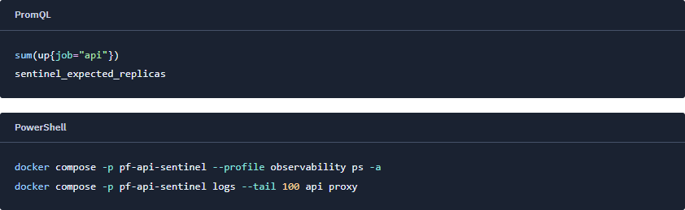

# Código nos procedimentos

O [formatador](../alert_receiver/code_format.py), o [CSS](../alert_receiver/styles.css) e os [testes](../tests/unit/test_code_format.py) definem a apresentação do código. A captura e suas medidas estão no [recibo visual de 22/09/2026, 18:05 UTC](screenshots/syntax-20260922/review.json).

Os runbooks conservam a linguagem indicada no Markdown ao gerar HTML. PromQL e
PowerShell recebem cores por função: comandos e funções em azul, strings em verde,
parâmetros e nomes de labels em ciano, números e variáveis em âmbar, operadores e
palavras reservadas em lilás. O rótulo acima de cada trecho informa a linguagem.



Captura de 22/09/2026, recortada diretamente do layout atual. As capturas de rodadas
anteriores continuam sendo registros históricos.

O [formatador](../alert_receiver/code_format.py) escapa todo o texto antes de inserir
os elementos visuais. Ele destaca os tokens das linguagens usadas nos procedimentos;
não executa, valida nem reformata comandos. Linguagens desconhecidas permanecem como
texto. Identificadores e mensagens de estado da central não recebem cores de código.
O destaque é gerado no servidor, funciona sem JavaScript e não depende de CDN ou de
biblioteca adicional. Linhas extensas rolam dentro do trecho focável por teclado.

Os [testes](../tests/unit/test_code_format.py) conferem preservação de caracteres,
espaços, quebras de linha e escape de HTML. A [verificação visual](screenshots/syntax-20260922/review.json)
cobriu os sete procedimentos em 1120, 390 e 320 px: texto idêntico ao Markdown,
nenhum overflow de página, nenhum erro JavaScript e contraste mínimo de 4,5:1 nos tokens.

Reprodução dos testes, no ambiente de desenvolvimento do projeto:

```sh
python -m pytest tests/unit/test_code_format.py tests/unit/test_receiver_ui.py tests/unit/test_receiver.py -q
```
