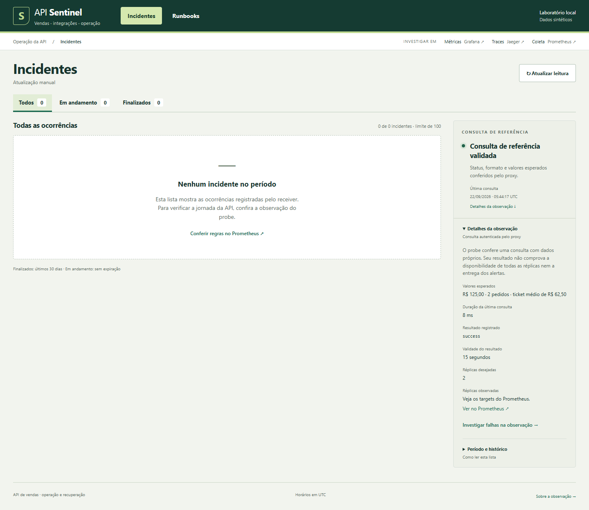
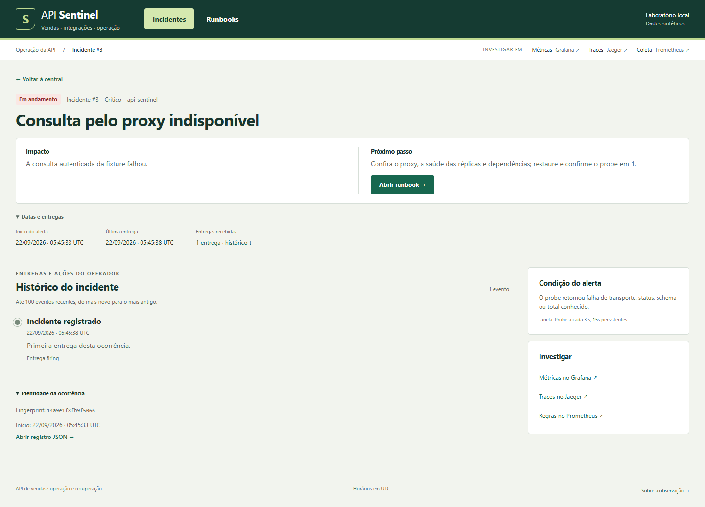

# Uma consulta conhecida, um incidente e sua recuperação

**Problema central:** o operador precisa distinguir um resultado financeiro correto, uma falha da consulta e uma recuperação confirmada. Uma tela sem incidentes, sozinha, não informa se a consulta autenticada funciona.

Esta sequência foi executada em **22/09/2026**, com a interface e os serviços locais reais. As vendas e o ERP são sintéticos. As três imagens pertencem à execução `20260922t054206130821z`; horários abaixo estão em UTC. O [registro completo da sequência](evidence/operational-story-20260922/20260922t054206130821z/proof.json) contém resultados, hashes, versão da ferramenta e limpeza.

## 1. Começar por uma conta que pode ser conferida

A consulta autenticada da loja técnica 7, em 01/01/2026, retornou **R$ 125,00 em dois pedidos**, com ticket médio de **R$ 62,50** e cobertura completa. A [fixture independente](../data/fixtures/manual-sales.json) permite conferir os três itens: R$ 50,00 + R$ 35,00 + R$ 40,00. Contar itens como pedidos produziria um ticket errado.



Captura às 05:44:20.107 UTC. O coletor conferiu a resposta HTTP autenticada; o painel mostra a observação recente do probe, que consulta essa referência conhecida. Isso comprova aquele resultado observado, não disponibilidade global. [Resposta e observações](evidence/operational-story-20260922/20260922t054206130821z/01-fixture-validada.json).

## 2. Reconhecer a falha e encontrar o procedimento

O runner interrompeu as duas réplicas da API do seu próprio projeto descartável. O probe deixou de conseguir consultar a API pelo proxy e o caminho Prometheus → Alertmanager → receptor criou a ocorrência **SentinelUnavailable #3**. O detalhe reúne impacto, condição observada, procedimento e identidade da ocorrência.



Captura às 05:45:39.238 UTC. A detecção medida pelo runner foi de **29,797 s**, desde antes do comando de parada até observar a entrega `firing`; inclui o tempo do comando. O alerta informa falha da consulta conhecida. Neste ensaio, a interrupção foi aplicada pelo [runner identificado por hash](../scripts/operations.py), não deduzida apenas da mensagem do alerta. [Observação durante a falha](evidence/operational-story-20260922/20260922t054206130821z/02-incidente-ativo.json).

## 3. Confirmar a recuperação da mesma ocorrência

Após iniciar novamente as réplicas, o monitoramento entregou o evento `resolved`. O receptor manteve ID, fingerprint e início da ocorrência e registrou a transição `recovered`. O runner voltou a conferir os mesmos valores financeiros e terminou com duas réplicas coletadas e nenhum incidente ativo.


Captura às 05:45:58.902 UTC. O runner observou a recuperação em **18,360 s**, contados após o comando de iniciar as réplicas retornar até observar `resolved`; esse número não inclui a duração do comando de restauração. Há duas entregas nessa ocorrência: abertura e recuperação. Não houve encerramento manual pelo operador. [Identidade e eventos após recuperação](evidence/operational-story-20260922/20260922t054206130821z/03-mesma-ocorrencia-recuperada.json).

## O que foi verificado nesta versão

O cenário `alerts` começou às 05:42:06.131820 UTC e terminou às 05:46:13.525113 UTC. A imagem é `sha256:94dcc15433c1927806cf2c108dca1ad82d44874d37bfe8f28e2d1fbf93d391a7`. A fonte foi um snapshot da árvore de trabalho com base em `b5f0eed`, identificado pelos [113 hashes operacionais](evidence/operational-story-20260922/20260922t054206130821z/source-files.json), incluindo a fixture e o coletor. Os arquivos permaneceram iguais durante a execução e coincidiram com o repositório na comparação posterior registrada. Edições posteriores precisam de sua própria conferência.

| Verificação | Resultado desta execução |
| --- | --- |
| Build, lint, formato, tipos e regras de monitoramento | Aprovados |
| Testes isolados | 257 testes e 11 subtests aprovados; 73 casos HTTP reservados para a etapa seguinte |
| HTTP pelo proxy | 73 testes aprovados, sem skips |
| Alertas reais | Ciclos de perda de réplica e indisponibilidade, ambos com recuperação |
| Financeiro | R$ 125,00 / 2 pedidos / ticket R$ 62,50 conferidos antes e depois |
| Investigação | Links de investigação e correlação de logs/traces aprovados pelo runner |
| Capturas | Navegador real, sem substituição do texto da página ou injeção de webhooks pelo coletor; nenhum erro de página registrado |
| Limpeza | Recursos do projeto descartável removidos; zero containers, volumes e redes desse namespace restantes |

Os [XMLs e demais contadores](evidence/operational-story-20260922/20260922t054206130821z/proof.json) separam testes de subtests e de observações. Os tempos de alerta são duas observações de um cenário local, não metas de serviço, percentis ou garantia de prazo. Esta rodada não repetiu o benchmark de carga nem o scan de vulnerabilidades. As provas anteriores têm suas próprias imagens e permanecem em [verificação](verification.md).

## Dificuldades preservadas

A [primeira tentativa](evidence/operational-story-20260922/attempt-01.json) parou nos testes: o arquivo da fixture financeira estava fora da lista usada para copiar e identificar as fontes. O runner passou a incluir `data/`; um teste de regressão demonstrou que alterar o resultado esperado da fixture muda a identidade das fontes. O controle negativo falhou antes da correção.

A [segunda tentativa](evidence/operational-story-20260922/20260922t053056476675z/proof.json) passou, mas usou uma revisão visual anterior à edição simultânea da interface. Seus resultados foram preservados. A execução apresentada nesta página foi repetida sobre o snapshot atualizado, com comparação dos hashes. O [índice das tentativas](evidence/operational-story-20260922/index.json) explicita qual foi selecionada; nenhum resultado reprovado foi transformado em sucesso.

## Como repetir

Use os requisitos Docker/Python do [roteiro operacional](demo.md). Para as imagens, também são necessários Node.js, um módulo Playwright instalado e um navegador Chromium compatível. Nesta execução: Node 24.19.0, `@playwright/test` 1.63.0 e Edge 153.0.4234.48. O coletor recebe os caminhos das instalações existentes; não instala dependências.

No primeiro terminal, na raiz do repositório:

```powershell
python scripts/review.py --scenario alerts --keep
```

No segundo, assim que `run.json` existir e **antes de terminar a etapa HTTP**, execute o [coletor versionado](../scripts/capture_operational_story.cjs), substituindo os três caminhos:

```powershell
node scripts/capture_operational_story.cjs --run-dir '<raiz>/artifacts/problem-review/<execucao>' --playwright-module '<diretorio instalado de @playwright/test>' --browser-executable '<executavel do navegador>'
```

Ele aguarda o sucesso HTTP e observa as transições ao vivo. Salva PNGs, observações e hashes em `operational-story/` dentro da execução; recusa sobrescrever uma coleta anterior. A coleta tem prazo de 15 minutos e deve terminar com status aprovado. Como `--keep` preserva a stack para inspeção, finalize com a [limpeza do namespace da execução](demo.md#encerrar-uma-execução-preservada), que configura `SENTINEL_RUN_DIR` e usa o comando registrado no próprio `run.json`.

Esta prova ajuda a conferir o comportamento do sistema. A capacidade de outra pessoa seguir o procedimento ainda depende do [exercício humano preparado](demo.md#exercício-com-outra-pessoa--preparado-ainda-não-realizado). Não há relato de cliente, implantação comercial ou tolerância à perda do computador nesta demonstração.
